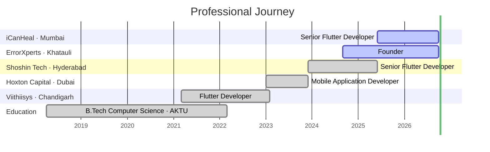
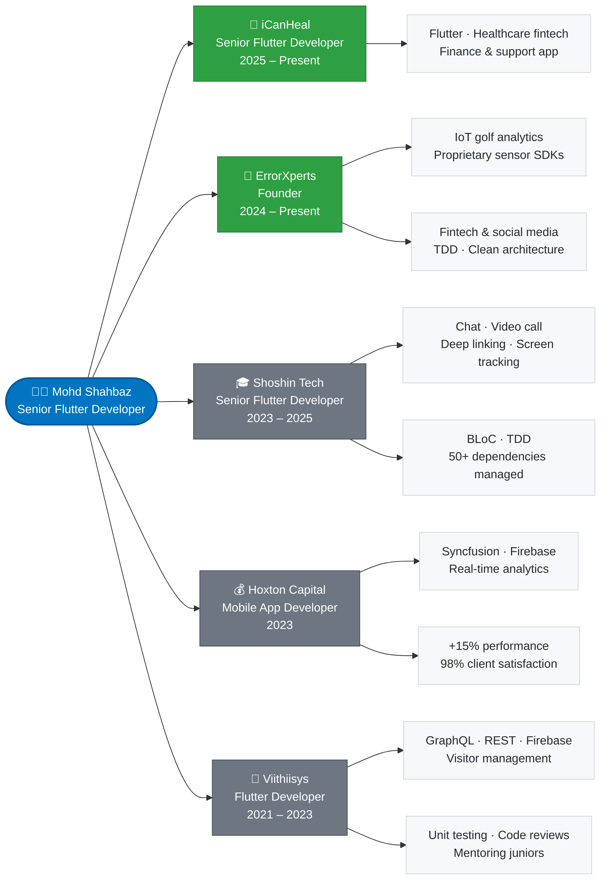

<!-- ============================================================================================================ -->
<!-- Top Banner with Name                                                                                          -->
<!-- ============================================================================================================ -->

  <h1 align="center">I'm <a href="https://github.com/shahbazakon">Mohd Shahbaz</a> </h1>
  

 

<!-- Running Text -->

  
  

<!-- ============================================================================================================ -->
<!-- About                                                                                                        -->
<!-- ============================================================================================================ -->
#  About

I am a **Senior [Flutter](https://flutter.dev/) Developer** with **5+ years** of experience shipping production apps for **iOS** and **Android**. I have led fintech, IoT and social-edutech products from architecture to store release, working with clean architecture, **[TDD](https://en.wikipedia.org/wiki/Test-driven_development)**, **[BLoC](https://bloclibrary.dev/)** and **[MVVM](https://en.wikipedia.org/wiki/Model%E2%80%93view%E2%80%93viewmodel)**, and rich data visualisation with **[Syncfusion](https://www.syncfusion.com/flutter-widgets)**. Alongside code, I bring a background in UX/UI design, content creation and photography.

**Key Points:**
* ☑️ Senior [Flutter](https://github.com/topics/flutter) Developer (Android & iOS), currently at [iCanHeal](https://play.google.com/store/apps/details?id=com.rxcs.icanheal) and founder of ErrorXperts
* ☑️ Proficient in [Dart](https://dart.dev/), [Firebase](https://firebase.google.com/), [GraphQL](https://graphql.org/) and REST APIs
* ☑️ Skilled in managing multiple client projects at once with strong analytical and problem-solving abilities
* ☑️ Background in UX/UI design, content creation and photography
* ☑️ ⭐⭐⭐⭐⭐ [HackerRank](https://www.hackerrank.com/profile/Shahbaz_Akon) in competitive programming, plus the 30 Days of Code challenge
* ⚡ Fun fact: **"If I can think, I can do... no matter if it's possible or not."**

  
  
  
  

<!-- ============================================================================================================ -->
<!-- Experience                                                                                                   -->
<!-- ============================================================================================================ -->
#  Experience

## Timeline  :

## Skills by Company  :

## Details  :

<b>🏥 iCanHeal</b> · Senior Flutter Developer · <i>Jun 2025 – Present</i> · Mumbai

* Senior Flutter Developer on the [icanheal: Finance & Support](https://play.google.com/store/apps/details?id=com.rxcs.icanheal) app, live on [Google Play](https://play.google.com/store/apps/details?id=com.rxcs.icanheal) and the [App Store](https://apps.apple.com/in/app/icanheal-finance-support/id6747173988).

<b>🚀 ErrorXperts</b> · Founder · <i>Sep 2024 – Present</i> · Khatauli, Uttar Pradesh

Full-cycle Flutter development for multiple clients across IoT, fintech and social media:
* Built IoT-based golf analytics applications using proprietary sensor SDKs.
* Delivered complete end-to-end services including architecture planning, state management and deployment.
* Managed multiple clients simultaneously while keeping code high-quality, scalable and maintainable with TDD and clean architecture.

<b>🎓 Shoshin Tech</b> · Senior Flutter Developer · <i>Dec 2023 – May 2025</i> · Hyderabad, Telangana

Led development of a social-edutech app from scratch using clean architecture and scalable Flutter code:
* Designed and implemented chat, video call, deep linking and screen tracking features.
* Applied TDD and [BLoC](https://bloclibrary.dev/) to ensure modularity and testability across modules.
* Managed 50+ dependencies and ensured performance optimisation and UI responsiveness.

<b>💰 Hoxton Capital Management</b> · Mobile Application Developer · <i>Jan 2023 – Nov 2023</i> · Dubai, UAE

Fintech product development with real-time data and analytics:
* Engineered financial modules using [Syncfusion](https://www.syncfusion.com/flutter-widgets) and [Firebase](https://firebase.google.com/) for dynamic insights.
* Optimised load times and app performance by 15%.
* Applied clean architecture and collaborated with cross-functional teams to achieve 98% client satisfaction.

<b>🏢 Viithiisys Technologies</b> · Flutter Developer · <i>Mar 2021 – Jan 2023</i> · Chandigarh

Fintech and visitor-management projects with high user load:
* Built new app modules using [GraphQL](https://graphql.org/), REST APIs and [Firebase](https://firebase.google.com/).
* Conducted unit testing and code reviews to improve app stability.
* Mentored junior developers and led feature delivery cycles.

<b>🎓 Education & Certifications</b>

* **B.Tech, Computer Science** · [APJ Abdul Kalam Technological University](https://aktu.ac.in/) · Apr 2018 – Feb 2022
* **12th Class (PCM)** · Shishu Shiksha Niketan Inter College · 2017 – 2018
* **High School (PCM)** · Shishu Shiksha Niketan Inter College · 2015 – 2016
* Certifications: Python for Beginners · Python · Computer System Security · Python 101 for Data Science

<!-- ============================================================================================================ -->
<!-- My Tech Stack                                                                                                -->
<!-- ============================================================================================================ -->
#  My Tech Stack

## Live Projects :

<table align="center">
  <tbody>
    <tr>
      <td align="center" width="150">
        
        
<b>iCanHeal</b>

        
        
      </td>
      <td align="center" width="150">
        
        
<b>Hoxton Capital</b>

        
        
      </td>
      <td align="center" width="150">
        
        
<b>Vizitor</b>

        
        
      </td>
      <td align="center" width="150">
        
        
<b>Vizitor Pass</b>

        
        
      </td>
      <td align="center" width="150">
        
        
<b>HP Pay</b>

      </td>
      <td align="center" width="150">
        
        
<b>Find Me</b>

      </td>
    </tr>
  </tbody>
</table>
 

## Personal Projects :

| 💻 **Technology** | 🚀 **Projects** |
|-|-|
|   |            |
|   |        |
|        |  |
|   |  |

 

## ToolKits :

  
  
  
  
  
  
  

 

<!-- ============================================================================================================ -->
<!-- Skill Set                                                                                                    -->
<!-- ============================================================================================================ -->
#  Skill Set

## Core Skill  :

<table align="center">
  <tbody>
    <tr>
      <td align="center"></td>
      <td align="center"></td>
      <td align="center"></td>
      <td align="center"></td>
      <td align="center"></td>
      <td align="center"></td>
    </tr>
  </tbody>
</table>

  
  
  
  
  
  
  
  
  

 

<!-- Languages and Framework -->
## Languages and Framework  :

<table align="center">
  <tbody>
    <tr>
      <td align="center"></td>
      <td align="center"></td>
      <td align="center"></td>
      <td align="center"></td>
      <td align="center"></td>
      <td align="center"></td>
      <td align="center"></td>
      <td align="center"></td>
      <td align="center"></td>
    </tr>
    <tr>
      <td align="center"></td>
      <td align="center"></td>
      <td align="center"></td>
      <td align="center"></td>
      <td align="center"></td>
      <td align="center"></td>
      <td align="center"></td>
      <td align="center"></td>
      <td align="center"></td>
    </tr>
  </tbody>
</table>

  
  
  
  
  
  
  
  
  
   
  
  
  
  
  
  
  
  
  

 

<!-- Tools -->
## Tools  :

<table align="center">
  <tbody>
    <tr>
      <td align="center"></td>
      <td align="center"></td>
      <td align="center"></td>
      <td align="center"></td>
      <td align="center"></td>
      <td align="center"></td>
      <td align="center"></td>
      <td align="center"></td>
      <td align="center"></td>
    </tr>
    <tr>
      <td align="center"></td>
      <td align="center"></td>
      <td align="center"></td>
      <td align="center"></td>
      <td align="center"></td>
      <td align="center"></td>
      <td align="center"></td>
      <td align="center"></td>
      <td align="center"></td>
    </tr>
  </tbody>
</table>

  
  
  
  
  
  
  
  
  
   
  
  
  
  
  
  
  
  
  

 

<!-- ============================================================================================================ -->
<!-- Connect with me                                                                                              -->
<!-- ============================================================================================================ -->
#  Connect with me  :

  
  &nbsp;
  
  &nbsp;
  
  &nbsp;
  
  &nbsp;
  <!--  &nbsp; -->
  
  &nbsp;
  
  &nbsp;
  
  &nbsp;
  
  &nbsp;
  
  <!--
   &nbsp;
  
  -->

 

 

<!-- GitHub Stats -->

  
  
  

 

<!-- Snake game (generated by .github/workflows/main.yml into the `output` branch) -->

  
  <!-- After the workflow has run once, swap the  above for this dark-mode aware block:
  <picture>
    <source media="(prefers-color-scheme: dark)" srcset="https://raw.githubusercontent.com/shahbazakon/shahbazakon/output/github-contribution-grid-snake-dark.svg">
    
  </picture>
  -->

<!-- ============================================================================================================ -->
<!-- Asset gallery (kept for reference, renders nothing)                                                           -->
<!-- ============================================================================================================ -->
<!--
<ul>
  1
  2
  3
  4
  5
  6
  7
  8
  9
  10
  11
  12
  13
  14
  15
  16
  17
  18
  19
  20
  21
  22
  23
  24
  25
  26
  27
  28
  29
  
</ul>
-->

